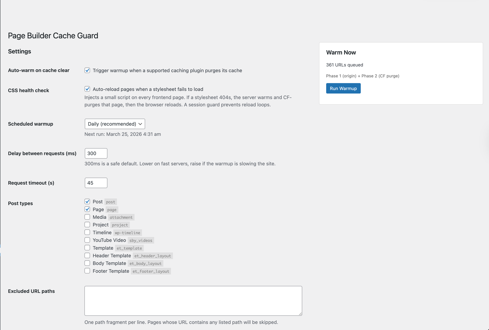
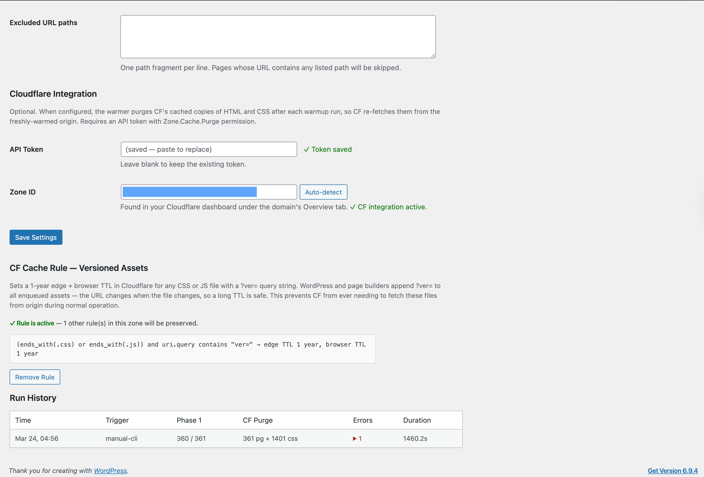

# Page Builder Cache Guard

**Prevents the "white page after cache purge" problem on WordPress sites using page builders.**

If you run Divi, Elementor, Beaver Builder, Bricks, or Oxygen behind a server-side page cache and/or Cloudflare, you've seen it: a cache purge happens, and the next visitor gets an unstyled page. The CSS files that page builders generate on first render haven't been regenerated yet, and the cached HTML is pointing at files that don't exist.

Page Builder Cache Guard fixes this with a three-phase approach: force-regenerate CSS on origin, purge stale server cache entries, and sync Cloudflare's edge via API. A client-side health check catches anything that slips through.




## The Problem

Page builders (Divi, Elementor, Beaver Builder, etc.) generate per-post CSS files on first render and cache them on disk. When a cache purge happens, three failure modes can break your site:

| Failure Mode | What Happens |
|---|---|
| **Origin Cold Start** | Page cache purged, next visitor triggers PHP render. Page builder writes CSS during render — everyone who arrived before the file was written gets a 404 on the stylesheet. |
| **Cloudflare Stale HTML** | Cloudflare serves cached HTML referencing CSS files that no longer exist at origin. Browser requests CSS, CF fetches from origin, gets 404. |
| **Page Cache / CSS Desync** | Server page cache serves HTML from before the most recent CSS regeneration. HTML references old filenames. |

## How It Works

### Phase 1 — Origin Warmup

After any cache purge event (or on a schedule, or manually), the plugin crawls every published page with a cache-bypassing query string. This forces a full PHP render, which makes the page builder write all CSS files to disk. Randomized bypass tokens ensure CDN edges also treat each request as uncached.

### Phase 1b — Server Page Cache Purge

When the client-side health check detects a broken page and triggers a heal, the plugin also purges the server-side page cache entry for that URL. Supports nginx-helper (FastCGI/Redis), WP Rocket, LiteSpeed Cache, W3 Total Cache, WP Super Cache.

### Phase 2 — Cloudflare Cache Purge (Optional)

Calls Cloudflare's Cache Purge API to drop cached HTML and page-builder CSS. Only targets dynamic CSS paths (et-cache, Elementor, Beaver Builder, Bricks, Oxygen, Kadence) — stable WordPress assets are left alone.

### Client-Side Health Check (Optional)

~600 bytes of inline JavaScript. Checks if every stylesheet loaded after page load. If any returns 404, calls the heal endpoint (Phase 1 + 1b + 2 for that URL), then reloads. Session storage guard prevents loops.

## Supported Page Builders

- Divi 4 (et-cache)
- Elementor (/elementor/css/)
- Beaver Builder (bb-plugin/cache)
- Bricks
- Oxygen
- Kadence Blocks
- GeneratePress

## Supported Cache Plugins

Auto-triggers warmup on cache clear from: WP Rocket, LiteSpeed Cache, W3 Total Cache, WP Super Cache, Autoptimize, GridPane nginx-helper, Elementor, Beaver Builder, Bricks.

## Installation

1. Download the latest release from [Releases](https://github.com/avanrossum/pb-cache-warmer/releases)
2. Upload to `/wp-content/plugins/`
3. Activate in WordPress admin
4. Go to **Settings → Cache Warmer**
5. Configure post types, schedule, and delay
6. (Optional) Add Cloudflare API token for Phase 2
7. (Optional) Enable client-side CSS health check
8. Click "Run Warmup" to warm immediately

Auto-updates via GitHub releases are built in.

## Cloudflare API Token

Create a token at [dash.cloudflare.com/profile/api-tokens](https://dash.cloudflare.com/profile/api-tokens):

| Permission | Scope | Required For |
|---|---|---|
| Zone — Cache Purge — Purge | Your zone | Phase 2 cache purge |
| Zone — Cache Settings — Edit | Your zone | Cache Rules management (optional) |
| Zone — Zone — Read | Your zone | Zone ID auto-detection (optional) |

## Advanced: Bypass Cloudflare for Phase 1

On CF-proxied servers, Phase 1 warmup traffic passes through Cloudflare unnecessarily. Send it directly to origin:

```php
add_filter( 'pbcw_origin_base', fn() => 'http://127.0.0.1' );
```

## Filters & Actions

| Hook | Type | Purpose |
|---|---|---|
| `pbcw_origin_base` | Filter | Override base URL for Phase 1 requests |
| `pbcw_post_types` | Filter | Add/remove post types from warmup |
| `pbcw_sslverify` | Filter | SSL verification toggle |
| `pbcw_dynamic_css_paths` | Filter | Define which CSS paths are page-builder-generated |
| `pbcw_purge_page_cache` | Action | Custom page cache purge integration |

## Requirements

- WordPress 6.0+
- PHP 8.0+
- Tested up to WordPress 6.8

## License

GPL-2.0-or-later

---

Built by [Alex van Rossum](https://mipyip.com/about) at [MipYip](https://mipyip.com). [Read the deep dive](https://mipyip.com/blog/page-builder-cache-guard) on why page builder sites break after cache purges. More tools at [mipyip.com/lab](https://mipyip.com/lab).
